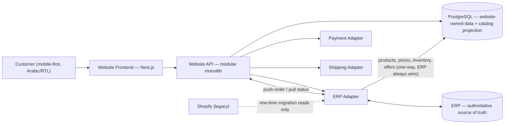
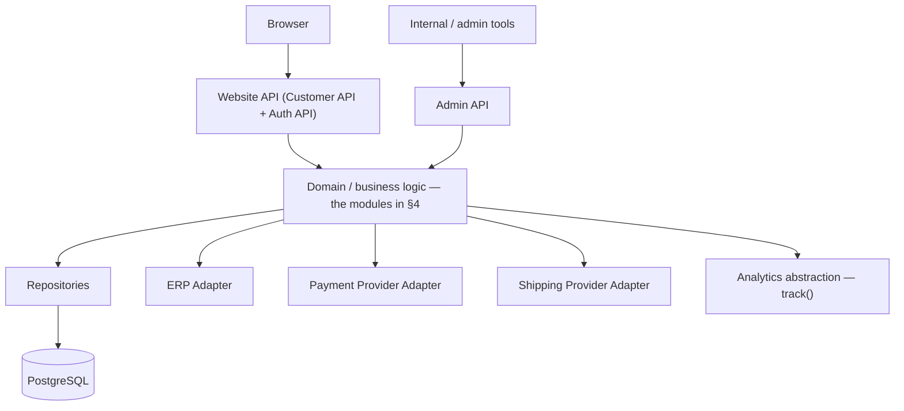
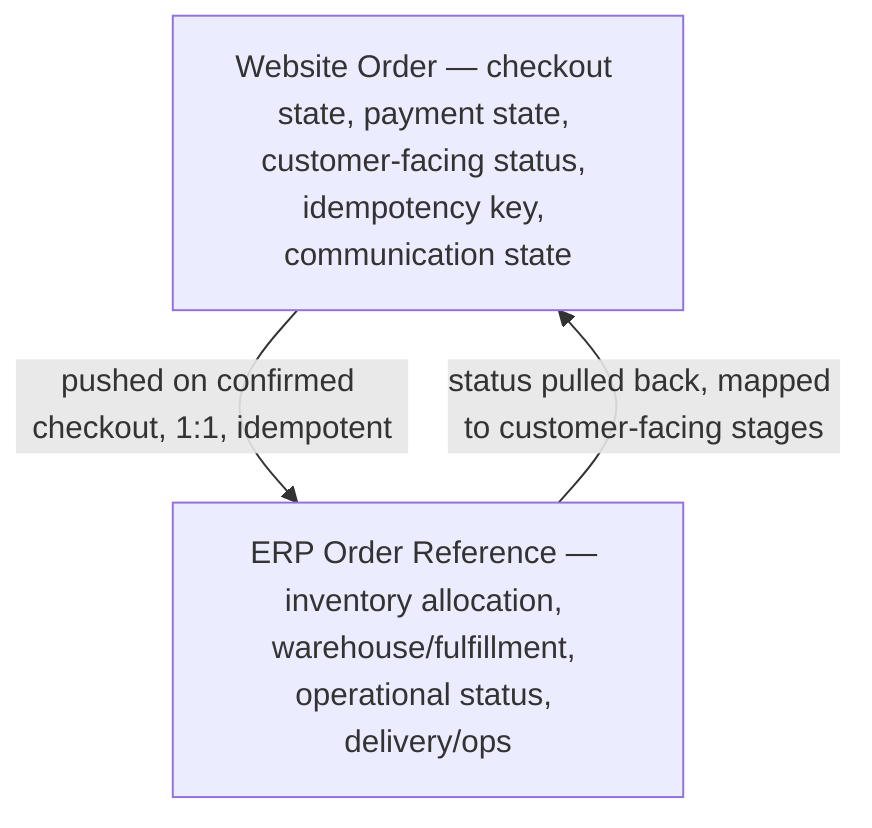
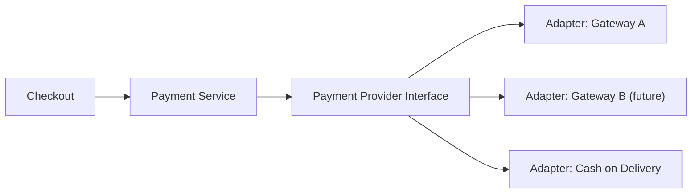
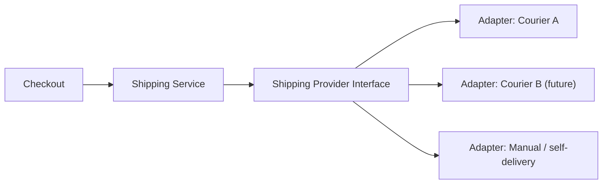
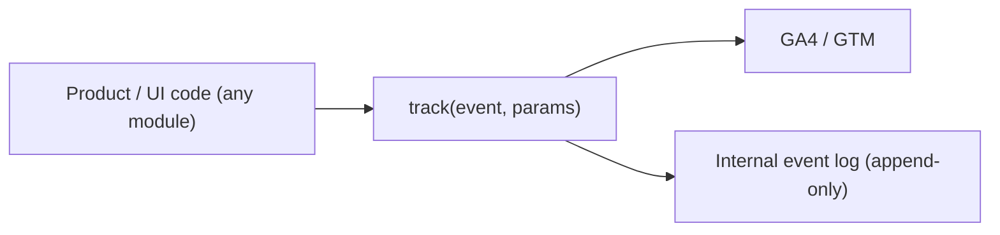
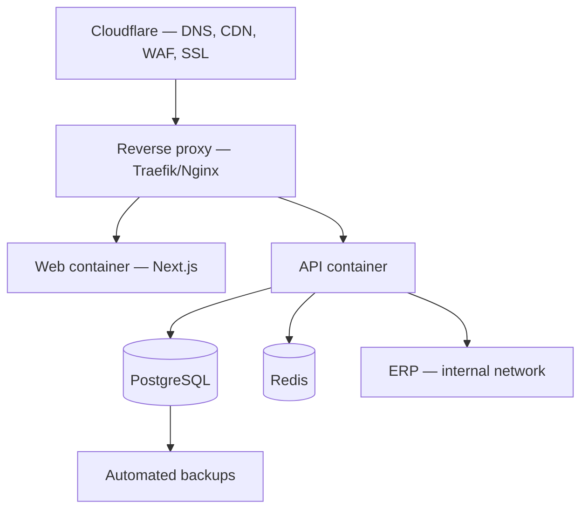

# Jawaher Al Khair — Architecture Blueprint

Canonical architecture reference. Supersedes/consolidates the Stage 0 (Discovery & Planning) and Stage 0.5 (Architecture Refinement) work. Read this before making any architectural decision.

Companion documents: [`architecture-decisions.md`](./architecture-decisions.md) (ADRs) · [`../requirements/website-functional-requirements.md`](../requirements/website-functional-requirements.md) (product/UX spec).

Status: **Approved, frozen ahead of Sprint 1.** Last updated: 2026-09-07.

---

## 1. Project understanding

Jawaher Al Khair (جواهر الخير) is a premium Egyptian food brand across five categories: **تمور** (dates), **عسل** (honey), **زيوت** (oils), **مكسرات** (nuts), **سمن** (ghee). Customers are Arabic-speaking, mobile-majority, and often arrive via social/ad links or WhatsApp rather than organic search. These are gift-worthy, trust-sensitive, provenance-driven purchases — premium positioning must show on every screen, not just the homepage.

The current storefront is Shopify, wired to an existing ERP. The target is an **owned website that talks directly to the ERP**; Shopify becomes a one-time migration source, not a runtime dependency.

Current approximate sales distribution (business guidance, confirmed 2026-09-07 — **not** a fixed database or business rule, and not a reason to treat any category as lower-priority in the architecture): dates ~50%, nuts ~20%, olive oil ~20%, honey ~7%, ghee and remaining products ~3%. All five categories remain first-class throughout this architecture — the website is not a dates-only site.

Constraints that shape everything below:
- The ERP remains the **operational source of truth** long-term (stock, pricing, fulfillment) — the website must never become a second source of truth for those facts.
- The frontend must **never** access PostgreSQL or the ERP directly — everything goes through the website's own API layer.
- Delivery is phased: each phase is implemented, tested, reviewed, and committed before the next begins (§19).

---

## 2. Target architecture



**Why not Website ↔ Shopify ↔ ERP:** keeping Shopify in the runtime path doubles latency and doubles the places inventory can drift out of sync. Shopify is read once (or on a short controlled window) to migrate historical products/orders/customers, then fully retired from the request path.

| Layer | Decision | Reasoning |
|---|---|---|
| Frontend | Next.js (App Router) + TypeScript + Tailwind | Mature RTL/i18n support, SSR/ISR for a catalog-heavy site, first-class image optimization, plays well with GSAP/Framer Motion. |
| Backend | Modular monolith inside the same app (§4) — not a standalone service yet | No traffic/team pressure forces a separate service yet. What matters is the internal boundary, not the deployment topology. |
| Database | PostgreSQL, one schema, website-owned — **not** a duplicate of the ERP's business domain | Holds website concerns plus a read-optimized catalog projection; never authoritative for ERP facts (§6). |
| Auth & sessions | Phone/OTP → website session → secure httpOnly cookie; guest checkout mandatory | Identity must not depend on Shopify or ERP accounts. |
| Caching | HTTP/ISR + CDN first; Redis only when a concrete need exists | Most catalog pages are read-heavy and change on ERP's schedule, not per-request. |
| Media | Object storage + CDN, served via Next/Image | Large photography/video assets don't belong in the app database. |
| Analytics | `track()` abstraction → GA4/GTM + internal event log (§14) | Analytics failures must never affect checkout. |
| Background jobs | Introduced only at the ERP Integration phase | Nothing to queue before ERP sync/retries/notifications exist. |
| Deployment | Dockerized, Cloudflare + reverse proxy, self-hosted target; Vercel for preview only | Matches the long-term self-hosting intent while keeping fast preview URLs during development. |

---

## 3. Website / API / database boundaries

**Non-negotiable rule:** `Browser → Website API/server layer → domain/business logic (modules) → repositories/adapters → PostgreSQL / ERP / payment / courier`. The frontend never imports Prisma, a Postgres client, or a provider SDK, and never calls the ERP, a payment gateway, or a courier directly. Enforced at code review from Sprint 1 onward.



| Surface | Consumers | Examples |
|---|---|---|
| Customer API | Storefront frontend only | catalog browse/search, cart, checkout, orders, account, addresses |
| Admin/internal API | Internal tooling/staff | content/offer management, order review, manual sync triggers |
| ERP Adapter | Internal modules only, never the frontend | `getProducts`, `getPrices`, `getInventory`, `pushOrder`, `getOrderStatus`, `reconcileCustomer` |
| Payment / Shipping adapters | Payments/Shipping modules only | authorize/capture/refund; serviceability/quote/track |
| Analytics abstraction | Any module, fire-and-forget | `track(event, params)` |
| Auth API | Storefront frontend | register/login, OTP verify, session refresh, logout |
| Webhooks/events | Internal consumers | `order.created`, `order.status_changed`, `stock.low` |

Reliability rules: URI-versioned (`/api/v1/...`); one consistent error shape (code, Arabic message, field errors); idempotency keys required on order-creation/payment-confirmation endpoints; rate limiting on auth and checkout endpoints.

---

## 4. Modular monolith — module map

One repository, one deployable Next.js application. Modules are **architectural boundaries enforced in code review, not services** — no module reaches into another module's tables directly.

| Module | Responsibility |
|---|---|
| Storefront | Page composition, SEO, rendering strategy per route |
| Catalog | Category/product/variant read model — the projection (§6) |
| Cart | Session/customer-scoped cart and cart items |
| Checkout | Orchestrates cart → address → shipping quote → payment → order creation |
| Orders | Website Order lifecycle + ERP Order Reference link (§8) |
| Customers | Identity, auth/OTP, sessions, addresses, profile |
| Payments | Payment Service + Provider Interface + adapters (§10) |
| Shipping | Shipping Service + Provider Interface + adapters (§11) |
| Promotions | Coupons and website-side promo rules; wraps ERP-defined pricing |
| Analytics | `track()` abstraction + internal event log |
| Content / Merchandising | Banners, homepage sections, offer copy, Products Experience content |
| ERP Integration | The ERP Adapter and its sync/retry logic (§9) |
| Notifications | Order emails/SMS, WhatsApp links, notification state |
| Infrastructure | Config, logging, env/secrets access, health checks |

This internal discipline — not the deployment topology — is what keeps future extraction into separate services possible later, if scale or team size ever justifies it.

---

## 5. ERP ownership & source-of-truth rules

The ERP is authoritative for: **SKU, variant, price, inventory, stock availability, fulfillment, warehouse operations, operational order state.** The website never edits these facts — it only displays a synced copy, and never becomes a second source of truth for them.

---

## 6. Catalog projection model

The website may cache a **read-optimized projection** of ERP product/price/inventory data for fast storefront rendering. On any conflict, **the ERP value always wins, with no exceptions.** The projection can lag briefly (eventual consistency) — the UI tolerates this (e.g. a "low stock" threshold shown slightly before true zero) rather than assuming perfect real-time accuracy.

```
ERP (authoritative) → ERP Adapter → Website Catalog Projection (read-optimized cache) → Customer Website
```

Not: `ERP Product ↔ Website Product ↔ Shopify Product`.

---

## 7. Data ownership matrix

| Entity | Category | Sync / conflict rule |
|---|---|---|
| Category/collection structure | Projection | ERP owns hierarchy; website only adds display metadata |
| Product core facts (SKU, price, stock) | Projection | ERP always wins; never edited website-side |
| Product rich content (description, story, photography) | Website-owned | No ERP concept of this exists |
| Customer profile | Shared | Website owns identity; reconciled into ERP at order time by phone/email |
| Address | Website-owned | Sent to ERP as part of the order payload only |
| Cart / cart item | Website-owned | Never sent to ERP until checkout completes |
| Website Order | Website-owned | Checkout/payment/customer-facing status; never overwritten by ERP |
| ERP Order Reference | ERP-owned | Inventory/warehouse/fulfillment/operational status; website only reads it |
| Coupon / simple promo code | Website-owned | Presentation-layer discount only, no margin logic |
| Promotion / pricing rule with margin impact | Projection | Website surfaces it, never invents or overrides it |
| Payment record | Website-owned | Provider-agnostic state machine (§10) |
| Shipping/delivery record | Website-owned | Rate/selection website-owned; courier's own tracking state is mirrored, not owned |
| Analytics events, idempotency keys, integration logs, notification state | Website-owned | Purely operational to the website |

**The one rule that matters:** any field that is a projection of an ERP fact — the ERP wins on conflict, no exceptions.

---

## 8. Website Order vs. ERP Order Reference

The website and the ERP are **never** two competing sources of truth for the same order.



| Layer | Owns | Example states |
|---|---|---|
| Website Order | Checkout, payment, customer-facing status, idempotency, communication | `created → payment_pending → paid → pushed_to_erp → cancelled/refunded` |
| ERP Order Reference | Inventory allocation, warehouse, fulfillment, operational status | ERP-internal codes, mapped one-way to `preparing → out_for_delivery → delivered` |

The customer never sees a raw ERP status code — only the mapped stage. The website order id is the idempotency key used when pushing to the ERP, so a retried push can never double-create the order.

---

## 9. ERP Adapter

All ERP communication passes through one isolated boundary exposing a fixed conceptual interface: `getProducts()`, `getProduct()`, `getPrices()`, `getInventory()`, `pushOrder()`, `getOrderStatus()`, `reconcileCustomer()`. The rest of the platform never cares whether the ERP speaks REST, GraphQL, SOAP, database views, or file exchange — only this module's internals would change.

| Concern | Pattern |
|---|---|
| Product/price/stock sync | Scheduled pull into the catalog projection; storefront never calls the ERP inline on a page request |
| Orders | Pushed immediately on confirmed checkout, idempotency key = website order id |
| Customers | Reconciled at order time (match phone/email, create if absent) — not continuous two-way sync |
| Order status | Pulled on a schedule (or webhook if available), mapped to stable customer-facing stages |
| Failure & retry | Exponential backoff + dead-letter table; failed order push alerts a human |
| Eventual consistency | UI tolerates a few minutes of staleness by design |

The exact protocol depends on what the existing ERP can expose — this section defines the target shape; see the open questions in the requirements doc for what's still unknown.

---

## 10. Payment Adapter



No gateway is chosen here — that's a business decision. Checkout only ever calls the Payment Service, which only ever calls the interface. States: `initiated → pending → authorized → captured → failed / cancelled → refund_initiated → refund_completed`.

## 11. Shipping Adapter



No courier is chosen here. The interface must expose, regardless of provider: serviceability check, delivery fee quote, delivery estimate, tracking lookup, COD support flag. A manually-maintained delivery-zone/fee table can be the launch-time "manual" adapter implementation, satisfying this without a real courier contract on day one.

---

## 12. Customer identity & guest checkout

`Customer → Phone/OTP → Website Authentication → Server-side session → Secure httpOnly cookie.` Identity never depends on a Shopify or ERP account. **Guest checkout is mandatory, not optional** — a customer is never forced to create an account to buy. Account creation is offered post-purchase, reusing the phone number already verified at checkout. Once created, an account unlocks order history, saved addresses, profile, favorites (if approved), reorder, and tracking without re-entering an order number. The OTP/authentication provider itself is a future decision.

---

## 13. API boundaries

See §3 for the enforced browser→API→module→repository/adapter chain and the customer/admin/ERP-adapter/provider-adapter/analytics surface table.

---

## 14. Analytics architecture



A single `track(event, params)` abstraction is the only thing product/UI code calls — no module imports a GA4/GTM SDK directly. Analytics is strictly observational: neither destination, nor a failure inside `track()` itself, can ever break cart, checkout, payment, or order creation.

---

## 15. Security architecture

| Area | Approach |
|---|---|
| Auth & sessions | Server-side sessions, httpOnly + Secure + SameSite cookies |
| CSRF | SameSite cookies + per-form token on state-changing endpoints |
| Input validation | Schema validation at every API boundary; server recomputes cart totals, never trusts client-supplied prices |
| Rate limiting | Reverse proxy/API gateway level, on auth and checkout endpoints |
| CORS | Locked to the site's own origins |
| Secrets management | Environment-injected, never committed to the repository |
| Database security | Least-privilege DB roles, parameterized queries, Postgres not exposed publicly |
| File upload security | Type/size validation, storage outside the web root, if/when introduced |
| Logging & audit | Structured logs for auth events, order state changes, admin actions |
| Backups & restore | Automated PostgreSQL backups with a periodically tested restore drill |

---

## 16. Performance principles — now vs. later

| Concern | Now | Later (when traffic requires it) |
|---|---|---|
| Rendering | ISR/SSG for Home/Category/PDP/About; SSR for Cart/Account/Checkout | Tune revalidation windows per real traffic |
| Caching | CDN + ISR | Redis for sessions/cart/catalog cache |
| Search | Indexed Postgres query (trigram/ILIKE) | Dedicated search once catalog size/relevance needs it |
| Jobs | None before ERP integration phase | Queue-backed workers for sync/retries/email |
| DB indexing | SKU, category id, order/customer FKs from day one | Query-plan-driven additions |
| Images | Next/Image, responsive sizes | Dedicated image CDN transforms if volume grows |
| Products Experience | Own code-split route, lazy-mounted chapters | Adaptive quality by measured device/network, if data justifies it |

Core Web Vitals targets apply to the storefront (Home/Category/PDP/Checkout); the Products Experience is isolated from those bundles and may carry a richer asset budget.

---

## 17. Products Experience architecture

Cinematic, scroll-driven storytelling — one chapter per category — that sits **beside** the fast Shop/PDP flow, never replacing it.

| Concern | Approach | Why |
|---|---|---|
| Scene choreography | GSAP + ScrollTrigger | Purpose-built for scroll-position-driven sequencing |
| Micro-interactions | Framer Motion / Motion | Cheaper for discrete component-level motion; complements GSAP |
| Character/product motion | Lottie | Lightweight vector beats, far cheaper than video or WebGL |
| Photographic beats | Optimized image sequences / short muted video loops | Real photography sells premium packaging |
| Canvas/WebGL | **Not justified initially** | No described sequence needs real-time 3D/particle simulation badly enough to justify the bundle weight, battery drain, and accessibility cost; revisit only if a specific beat genuinely fails otherwise |
| Mobile | Fewer scenes, transform-only animation, shorter scrub distances | Scroll-jank is the fastest way to make "premium" feel cheap |
| Reduced motion | Static hero + same copy + same CTA per chapter | Accessibility requirement and a legitimate fast-path |
| Lazy loading | Per-chapter assets mount only on viewport entry (IntersectionObserver) | Keeps first paint fast despite a large total asset budget |
| Isolation | Own route/bundle, code-split from Shop/PDP/checkout | Guarantees it can never regress the converting pages' Core Web Vitals |

---

## 18. Deployment direction (target, not built yet)



Dockerized web + API containers on company infrastructure; docker-compose is likely sufficient at this scale (no case for Kubernetes yet). Vercel hosts frontend preview deployments only, never the production purchase flow. **All of this is out of scope for Sprint 1** — it belongs to the Infrastructure phase (§19), well after the commerce core and ERP integration are proven in a development environment.

---

## 19. Development roadmap / phases

| # | Phase | Objective | Exit criteria |
|---|---|---|---|
| 0 | Planning | Architecture, requirements, ADRs | Human review & sign-off |
| 1 | Foundation | Reviewable project skeleton | Skeleton live on a preview URL; no business logic |
| 2 | Design system | Brand assets → tokens/components | Component library reviewed against real brand assets |
| 3 | Frontend | Static/mock-data storefront shell | Full click-through demo on mock data |
| 4 | Backend | Real data model + core APIs | Storefront wired to real APIs, passing integration tests |
| 5 | Commerce | Checkout, Website Order + ERP Order Reference, Payment/Shipping adapters against mock providers | E2E purchase flow passes on mock providers; idempotency verified |
| 6 | ERP integration | Replace mocks with the real source of truth | Order round-trips correctly against ERP sandbox/staging |
| 7 | Analytics | Event taxonomy through `track()` | Funnel dashboard shows real events from a staged walkthrough |
| 8 | Products Experience | Five storytelling chapters | Passes performance and reduced-motion review on real devices |
| 9 | Testing | E2E, adapter tests, load test, ERP-failure simulation | Regression suite green, load test meets target |
| 10 | Performance | CWV tuning on real content | CWV targets met on real catalog data |
| 11 | Infrastructure | Docker/Traefik/Cloudflare, backups, monitoring | Production environment passes a fire-drill restore test |
| 12 | Migration | One-time Shopify historical import | Migrated data verified; Shopify disconnected from runtime |
| 13 | Launch | DNS cutover, real payment/courier plugged into adapters | Live traffic stable, no P0 issues |

---

## 20. Architectural constraints (recap)

- Website ↔ ERP directly; Shopify is migration-only.
- ERP is authoritative for ERP-owned operational facts; the website database is not a duplicate ERP.
- Catalog data exists only as a read-optimized projection.
- Customer identity is website-owned; guest checkout is mandatory.
- Payment and Shipping each sit behind a Provider Adapter; no provider is hard-coded.
- All ERP communication goes through one ERP Adapter.
- Analytics is a one-way, non-blocking abstraction.
- Modular monolith first — one deployable app, hard internal module boundaries.
- The frontend never directly accesses PostgreSQL, the ERP, or any external provider.

## 21. Deferred technologies & why

| Technology | Status | Why deferred |
|---|---|---|
| Redis | Conditional | No shared-cache/session-store need exists yet; add when session volume, cart reads, or catalog-lookup load justify it |
| Background job queue | Conditional | Nothing to queue before the ERP Integration phase (sync, retries, notifications) |
| Canvas/WebGL | Deferred | No Products Experience scene needs real-time 3D/particle simulation badly enough to justify the cost |
| Production infrastructure (Docker prod, Cloudflare, monitoring) | Deferred to Infrastructure phase | Sprint 1 is a development foundation only |
