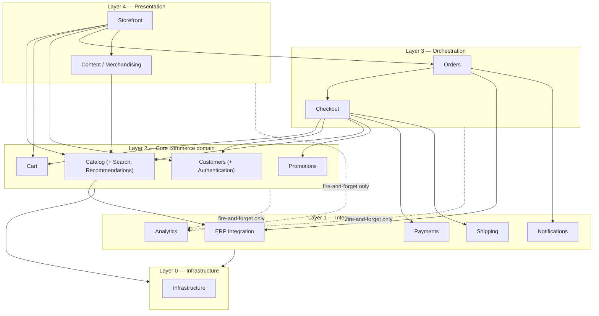

# Jawaher Al Khair — Module Boundaries & Dependency Rules

Elaborates the 14 approved modules from [`blueprint.md`](./blueprint.md) §4 into a dependency-direction model, and states the internal sub-domains this stage introduces (Categories, Products, Variants, Pricing, Inventory Projection, Authentication, Search, Recommendations) as **sub-concerns within those 14 modules, not new top-level modules** — see `technical-decisions.md` §B for why.

Status: **Draft for review — Stage 0.9.** Last updated: 2026-09-06.

---

## 1. The 14 modules, with sub-domains

| Module | Sub-domains it owns | Public interface (examples) |
|---|---|---|
| Storefront | Page composition, SEO, rendering strategy | (consumes other modules' interfaces; owns no data itself) |
| Catalog | Categories, Products, Variants, Pricing, Inventory Projection, **Search**, **Recommendations** | `getCategory()`, `getProduct()`, `listProducts(filters)`, `search(query)`, `getRecommendations(context)` |
| Cart | Cart, cart items | `getCart()`, `addItem()`, `updateQuantity()`, `removeItem()`, `mergeGuestCart()` |
| Checkout | Checkout orchestration | `startCheckout()`, `setAddress()`, `getShippingRates()`, `applyCoupon()`, `submitPayment()` |
| Orders | Website Order, ERP Order Reference | `createOrder()`, `getOrder()`, `getOrderStatus()`, `trackOrder()` |
| Customers | Identity, **Authentication**, sessions, addresses, profile, favorites | `requestOtp()`, `verifyOtp()`, `getSession()`, `getProfile()`, `listAddresses()` |
| Payments | Payment Service + Provider Interface + adapters | `createPayment()`, `confirmPayment()`, `refund()`, `getPaymentStatus()` |
| Shipping | Shipping Service + Provider Interface + adapters | `checkServiceability()`, `getRates()`, `createShipment()`, `getTracking()` |
| Promotions | Coupons, website-side promo rules | `validateCoupon()`, `applyCoupon()` |
| Analytics | `track()` abstraction, internal event log | `track(event, params)` |
| Content / Merchandising | Homepage sections, category story copy, Products Experience content, offer banners | `getHomepageSections()`, `getCategoryStory()`, `getExperienceChapter()` |
| ERP Integration | ERP Adapter and its sync/retry logic | `getProducts()`, `getPrices()`, `getInventory()`, `pushOrder()`, `getOrderStatus()`, `reconcileCustomer()` |
| Notifications | Order/OTP/status messages, provider-agnostic | `notify(type, recipient, payload)` |
| Infrastructure | Config, logging, secrets access, health checks | `getConfig()`, `logger`, `healthCheck()` |

**Why Search and Recommendations live inside Catalog, not as new top-level modules:** both are read-only views over catalog data (product/category rows plus curated merchandising flags) with no independent data-ownership story of their own — they don't manage a distinct entity the way Cart or Orders do. Elevating them to top-level modules would grow the approved module count without a corresponding new data boundary. **Why Authentication lives inside Customers, not standalone:** identity, session, and OTP verification are one cohesive concern (blueprint §12) — splitting them would just move code around a single boundary, not create a new one.

---

## 2. Dependency-direction model

Dependencies point strictly downward (higher layer → lower layer); a lower layer never imports from a higher one. Analytics is reachable from anywhere but only as a one-way, fire-and-forget call (ADR-012) — it is drawn separately because it is not part of the request/response dependency chain at all.

---

## 3. Prohibited dependencies

| Rule | Reason |
|---|---|
| Storefront/Content **MUST NOT** import Prisma, a Postgres client, or any provider SDK; **MUST NOT** call the ERP, a payment gateway, or a courier directly | ADR-014 — the frontend/presentation layer only ever calls module public interfaces |
| Catalog **MUST NOT** be written to by anything except the ERP Integration module's sync job (for projected fields) or the Content module's own tables (for website-owned rich content) | Prevents the catalog projection from silently becoming a second source of truth (ADR-004/ADR-005) |
| Cart **MUST NOT** trust a client-supplied price or inventory value — it re-reads Catalog at every mutation | technical-architecture.md §8 |
| Checkout/Orders **MUST NOT** call a payment or courier provider SDK directly — only through the Payments/Shipping modules' interfaces | ADR-009/ADR-010 |
| Payments **MUST NOT** depend on Orders' internals — it only knows a generic payment-subject reference (order id + amount), never order line items | Keeps the Payment Adapter reusable and prevents a circular Orders↔Payments dependency |
| Shipping **MUST NOT** depend on Orders' internals — same reasoning, only address + weight/count if needed | Keeps the Shipping Adapter provider-agnostic |
| Nothing outside ERP Integration **MUST** call the ERP directly | ADR-011 |
| Analytics **MUST NOT** be depended on by any module's core logic path — it is called, never awaited-and-branched-on | ADR-012 |
| Promotions **MUST NOT** own margin-impacting pricing rules — those stay ERP-projected; Promotions only owns simple website coupon codes | blueprint §7 data ownership matrix |
| Recommendations (Catalog sub-domain) **MUST NOT** require Analytics or an ML pipeline at MVP | requirements §13 — curated/rule-based only |
| Search (Catalog sub-domain) **MUST NOT** depend on an external search service at MVP | technical-architecture.md §14 |
| Domain modules **MUST NOT** depend on UI components | Keeps `modules/*` framework-agnostic and independently testable |
| Core commerce (Cart/Checkout/Orders) **MUST NOT** depend on a specific payment provider or courier | ADR-009/ADR-010 — only on the adapter interface |

Any code review that finds one of these rules violated should treat it as a defect, not a style preference.
